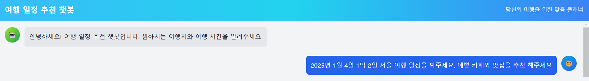

# 🧭 여행 일정 추천 챗봇, TripChat

## 프로젝트 개요

새로운 여행지를 계획하는 일은 관광지, 맛집, 평점, 영업 시간, 휴무일, 거리, 교통수단, 체류 시간 등 여러 요소를 고려해야 하기에 매우 번거롭습니다. TripChat은 이러한 과정을 간소화하여 사용자의 선호도와 필요에 맞춘 개인화된 여행 일정을 제공합니다.

---

## 팀원
- 강지민
- 김성훈
- 윤상묵
- 하지원
- 황치운

---

## 사용 방법

1. **대화 시작:** 챗봇에게 목적지와 도착 시간을 질문하세요.
2. **일정 세부 조정:** 추가 정보를 제공하여 더욱 맞춤화된 일정을 받아보세요.



---

## 배포 링크
서비스를 이용하려면 여기를 클릭하세요: [TripChat](https://tripchat.vercel.app/)

---

## 로컬 개발 환경 설정

### 백엔드 설정

1. **(선택)** 가상 환경 설정:
    ```bash
    cd back
    python -m venv venv
    source venv/Scripts/activate  # Windows의 경우
    ```

2. 필요한 라이브러리 설치:
    ```bash
    pip install -r requirements.txt
    ```

3. `.env` 파일 생성:
    - `.env.example` 파일을 참고하여 필요한 API 키를 설정하세요.

4. 백엔드 서버 실행:
    ```bash
    python app.py
    ```
    개발 중에는 서버를 계속 실행 상태로 유지하세요.

### 프론트엔드 설정

1. 새 터미널을 열고 프론트엔드 디렉터리로 이동:
    ```bash
    cd front
    ```

2. 종속성 설치:
    ```bash
    npm install
    ```

3. 프론트엔드 서버 시작:
    ```bash
    npm start
    ```

